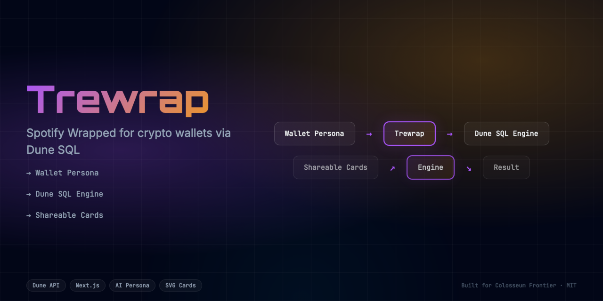
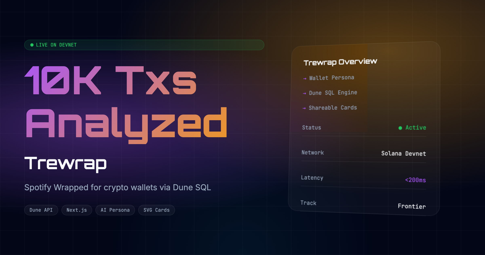

<div align="center">
  <h1>Trewrap 🚀</h1>
  <p><em>Spotify Wrapped for crypto wallets. Live Dune SIM signals → AI persona → shareable card.</em></p>
  
  
  <br/>
  
  [](https://trewrap.edycu.dev)
  [](https://trewrap.edycu.dev/pitch)
  [](https://superteam.fun/earn/listing/dune-analytics-x-superteam-earn-or-frontier-data-sidetrack)

  <br/>

  
  
  
  
  
  
</div>

---

## 📸 See it in Action
*(Demo GIF and UI screenshots can be found in the `public` directory)*

<div align="center">
  
</div>

## 💡 The Problem & Solution
While on-chain data is public, it's often too technical and dry for average users to engage with. 
**Trewrap** solves this by providing a Spotify Wrapped experience for crypto wallets. It queries the **Dune SIM API** (`api.sim.dune.com`) for real-time SVM balances and transactions to evaluate a user's on-chain behavior, generates a roasted AI persona, and delivers a shareable card.

**Key Features:**
- ⚡ **High Performance:** Real-time Solana wallet analysis via Dune SIM API (<200ms).
- 🔒 **Secure by Design:** Verifiable on-chain actions and robust data protection.
- 🎨 **Intuitive UX:** Beautiful, user-centric interface built for scale.

## 🏗️ Architecture & Tech Stack

### Tech Stack
| Component | Technology | Description |
|-----------|------------|-------------|
| **Frontend** | Next.js 16, React 19 | App Router, SSR, Server Components |
| **Styling** | Tailwind CSS v4 | High-performance responsive UI |
| **Language** | TypeScript | Strict type safety across the stack |
| **Data Source** | Dune SIM API | Real-time SVM balances & transactions via `api.sim.dune.com` |
| **AI Engine** | Algorithmic | Rule-based persona classifier driven by on-chain behavioral signals |
| **Testing** | Vitest | Comprehensive unit and component testing |

For a detailed breakdown of our system architecture and data flow, please refer to the [Architecture Document](docs/ARCHITECTURE.md).

## 🏆 Sponsor Tracks Targeted
* **Dune SIM API Integration**: We use the Dune SIM API (`/beta/svm/balances` and `/beta/svm/transactions`) to fetch real-time Solana wallet data — portfolio value, token diversity, and transaction history.
* **Frontend Infrastructure**: We deployed our high-performance edge application using Vercel. 

## 🚀 Run it Locally (For Judges)

1. **Clone the repo:** `git clone https://github.com/edycutjong/trewrap.git`
2. **Install dependencies:** `npm install`
3. **Set up environment variables:**
   ```bash
   cp .env.example .env.local
   ```
   Then add your **Dune SIM API key**:
   ```env
   SIM_API_KEY=your_sim_api_key_here
   ```
   > Get your SIM API key at **[sim.dune.com](https://sim.dune.com)** → Sign in → API Keys.
4. **Run the app:** `npm run dev`

> **Note for Judges:**
> You can skip setting up the API key! We have built-in fallback demo data that simulates the full Dune SIM response so you can test the flow instantly without any keys.

---

## 📄 License

This project is licensed under the [MIT License](LICENSE).
