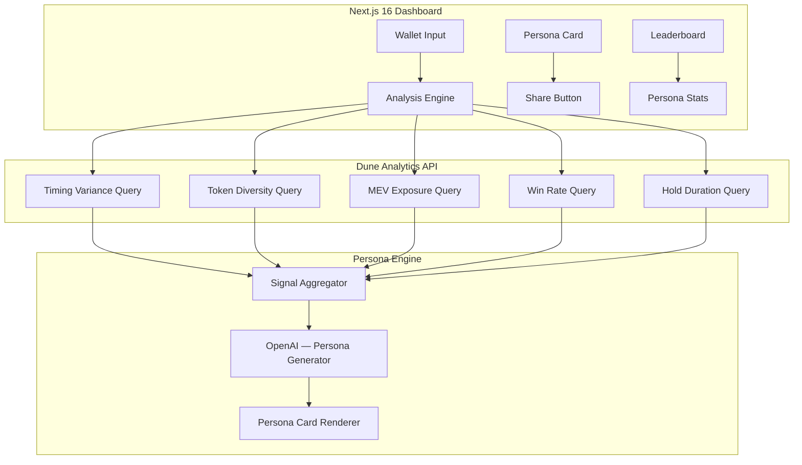

# Trewrap — Technical Architecture

## System Architecture



## Tech Stack

| Layer | Technology |
|---|---|
| **Frontend** | Next.js 16, React 19, Tailwind v4 |
| **Data** | Dune Analytics API (5 custom SQL queries) |
| **AI** | OpenAI API (persona + roast generation) |
| **Sharing** | html-to-image (card export) |
| **Database** | Supabase (cached results, leaderboard) |

## Dune SQL Integration Map

| Query | Signal | SQL Pattern |
|---|---|---|
| **Timing Analysis** | When does the wallet trade? (insomniac?) | `GROUP BY HOUR(block_time)` |
| **Token Diversity** | How many unique tokens? (degen or blue-chip?) | `COUNT(DISTINCT token_address)` |
| **MEV Exposure** | How often sandwiched? | `JOIN mev_sandwiches ON tx_hash` |
| **Win Rate** | % of swaps that were profitable | `SUM(CASE WHEN pnl > 0 ...)` |
| **Hold Duration** | Average time between buy→sell | `AVG(sell_time - buy_time)` |

## Database Schema

```sql
CREATE TABLE wallet_analyses (
    id UUID PRIMARY KEY DEFAULT gen_random_uuid(),
    wallet_address TEXT NOT NULL,
    timing_score NUMERIC,
    diversity_score NUMERIC,
    mev_score NUMERIC,
    win_rate NUMERIC,
    hold_duration_avg INTERVAL,
    persona_title TEXT,
    persona_roast TEXT,
    card_image_url TEXT,
    created_at TIMESTAMPTZ DEFAULT NOW()
);

CREATE TABLE persona_leaderboard (
    persona_title TEXT PRIMARY KEY,
    count INT DEFAULT 1,
    updated_at TIMESTAMPTZ DEFAULT NOW()
);
```

## API Routes

| Method | Path | Description |
|---|---|---|
| POST | `/api/analyze` | Submit wallet → run 5 Dune queries |
| GET | `/api/persona/:wallet` | Get cached persona result |
| GET | `/api/leaderboard` | Most common persona archetypes |
| POST | `/api/share` | Generate shareable card image |
